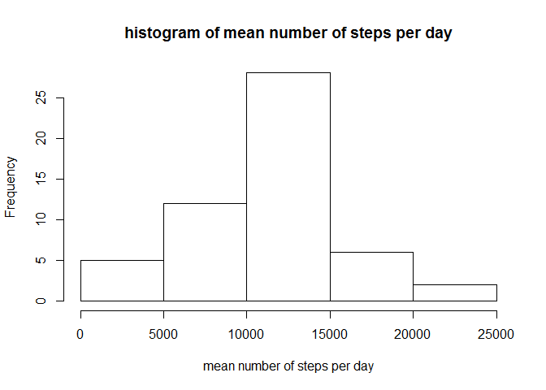
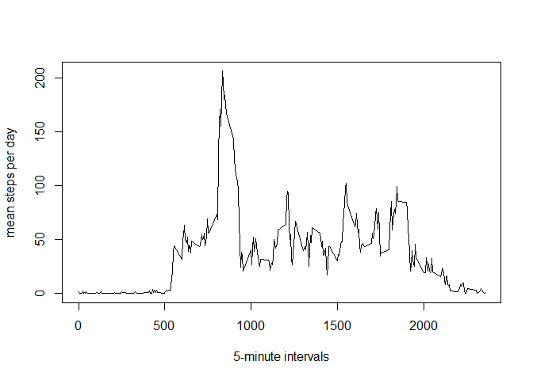
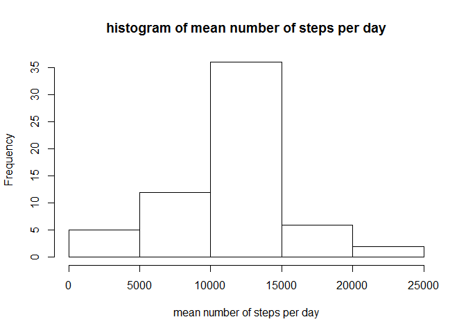
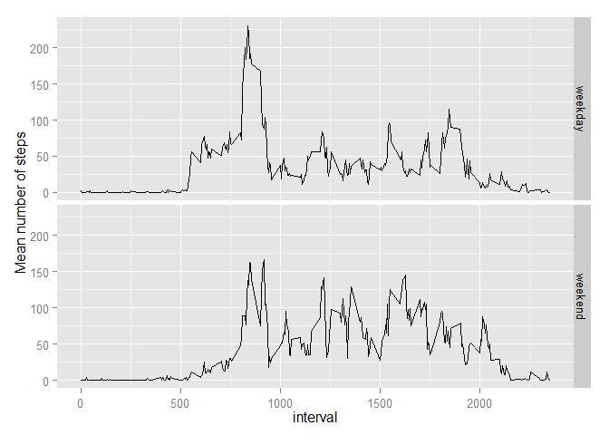

# Reproducible Research: Peer Assessment 1


**1. Loading and preprocessing the data**  

-Tell R that the date column has a date.time format

```r
setwd("C:/Users/beuk__000/Desktop/Course")
data<-read.csv("activity.csv")
data$date<-as.POSIXct(strptime(data$date, format= "%Y-%m-%d", tz='EST'))
data1<-data[!is.na(data$steps),]
```

**2. Mean total number of steps taken per day**  
 
- Histogram, mean and median of the number of steps per day


```r
sumsteps<-aggregate(data1$steps, list(data1$date), sum)
names(sumsteps)<- c("date", "sumsteps")
hist(as.numeric(sumsteps$sumsteps), xlab="mean number of steps per day", main="histogram of mean number of steps per day")
```

 

```r
mean(sumsteps$sumsteps)
```

```
## [1] 10766.19
```

```r
median(sumsteps$sumsteps)
```

```
## [1] 10765
```

**3. Average daily activity pattern**  

- Create a plot for the average number of steps taken per interval, averaged across all days


```r
forplot<-aggregate(data1$steps, list(data1$interval), mean)
names(forplot)<-c("interval", "mean_steps")
plot(forplot$interval, forplot$mean_steps, type="l", xlab="5-minute intervals", ylab="mean steps per day")
```

 
- Display the interval which contains the maximum steps

```r
max<-max(forplot$mean_steps)
max.interval<-forplot[forplot$mean_steps==max,]
max.interval$interval
```

```
## [1] 835
```

**4. Imputting missing values**  

- Show total number of missing values 


```r
summary(data)
```

```
##      steps             date               interval     
##  Min.   :  0.00   Min.   :2012-10-01   Min.   :   0.0  
##  1st Qu.:  0.00   1st Qu.:2012-10-16   1st Qu.: 588.8  
##  Median :  0.00   Median :2012-10-31   Median :1177.5  
##  Mean   : 37.38   Mean   :2012-10-31   Mean   :1177.5  
##  3rd Qu.: 12.00   3rd Qu.:2012-11-15   3rd Qu.:1766.2  
##  Max.   :806.00   Max.   :2012-11-30   Max.   :2355.0  
##  NA's   :2304
```
- Fill in missing values of number of steps by taking the mean of that interval 

```r
stepsmean<-aggregate(data1$steps, list(data1$interval), mean)
names(stepsmean)<- c("interval", "meansteps")
nadata<-data[is.na(data$steps),]
for (i in 1: nrow(nadata)){ 
        
        input<- subset(stepsmean, nadata$interval[i]==stepsmean$interval, select= "meansteps")
        nadata$stepsfilled[i]<-input 
                
}
```
- Create a new dataset with the NA's filled in (newdata) 

```r
stepsfilled<-do.call(rbind.data.frame, nadata$stepsfilled)
newdata1<-cbind(nadata, stepsfilled)
newdata2<-newdata1[,c(5,2,3)]
colnames(newdata2)[1]<-"steps"

newdata<-rbind(data[!is.na(data$steps),], newdata2)
```
- Show histogram, mean and medium from the total number of steps taken per day

```r
sumstepsnew<-aggregate(newdata$steps, list(newdata$date), sum)
names(sumstepsnew)<- c("date", "sumsteps")
hist(as.numeric(sumstepsnew$sumsteps), xlab="mean number of steps per day", main="histogram of mean number of steps per day")
```

 

```r
mean(sumsteps$sumsteps)
```

```
## [1] 10766.19
```

```r
median(sumsteps$sumsteps)
```

```
## [1] 10765
```
The original data and the NA-filled data have exactly the same mean and medium. The estimates of the number of steps stay the same.

**5. Differences in activity patterns between weekdays and weekends**  

- Create a new dataset with a new column with the two levels weekday and weekend.


```r
newdata$day<-weekdays(newdata$date)
weekend<- newdata[newdata$day=="Saturday" | newdata$day == "Sunday",]
weekend$cat<-"weekend"
weekday<-newdata[newdata$day!="Saturday" & newdata$day != "Sunday",]
weekday$cat<-"weekday"
daydata<-rbind(weekend, weekday)
```
- Panel plot of the 5 minute interval and the average number of steps taken per week- and weekendday

```r
meansteps2<-aggregate(daydata$steps, list(daydata$interval, daydata$cat), mean)
names(meansteps2)<-c("interval", "cat", "meansteps")
library(ggplot2)
ggplot(meansteps2, aes(interval, meansteps)) + geom_line() + facet_grid(cat ~ .) + ylab("Mean number of steps")
```

 
